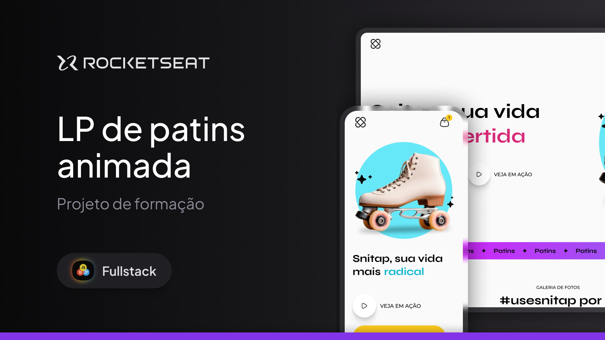

  
    

## 📖 Sobre

Projeto 06 do [MBA Rocketseat Full-stack](https://www.rocketseat.com.br/mba) para reforçar os conceitos de **animações e transições no CSS**.

  
    

 

## 🎨 Protótipo

Protótipo do projeto foi desenvolvido no Figma e pode ser acessado [aqui](files/prototype.fig) (by [Rocketseat](https://github.com/rocketseat) ❤️).

 

## 🚀 Visualizar o Projeto

O projeto poderá ser visualizado [aqui](https://danilosalvador.github.io/snitap/).

 

## 📝 Licença
Esse projeto está sob a licença MIT. Veja o arquivo [LICENSE](LICENSE) para mais detalhes.